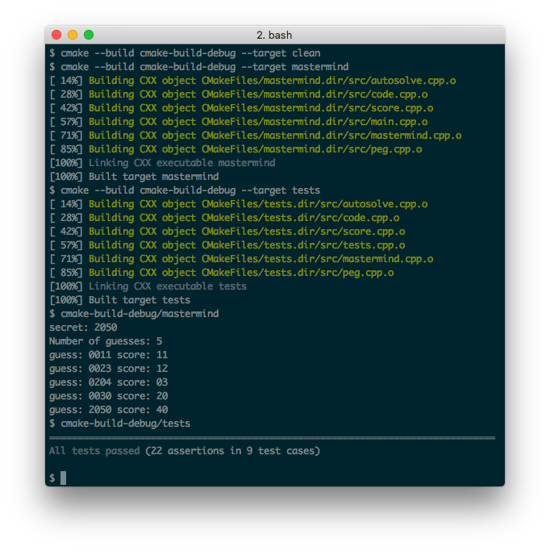

## Description

C++ implementation of
[Knuth's algorithm](https://en.wikipedia.org/wiki/Mastermind_(board_game)#Five-guess_algorithm)
to solve MasterMind within 5 guesses.

## Building and Running

```
cmake --build cmake-build-debug --target clean
cmake --build cmake-build-debug --target mastermind
cmake --build cmake-build-debug --target tests
cmake-build-debug/mastermind
cmake-build-debug/tests
```

## Screenshot



## Links

* [Mastermind (board game)](https://en.wikipedia.org/wiki/Mastermind_(board_game))
* [Five-guess algorithm](https://en.wikipedia.org/wiki/Mastermind_(board_game)#Five-guess_algorithm)
* [Knuth's mastermind algorithm](https://math.stackexchange.com/questions/1192961/knuths-mastermind-algorithm)
* [An implementation of Knuth's five-guess algorithm to solve a mastermind code](https://gist.github.com/firebus/2153677)
* [knuth-mastermind.pdf](https://www.cs.uni.edu/~wallingf/teaching/cs3530/resources/knuth-mastermind.pdf)
* [Mastermind using SVG and Vue.js](https://github.com/taylorjg/mastermind-svg-vue)
